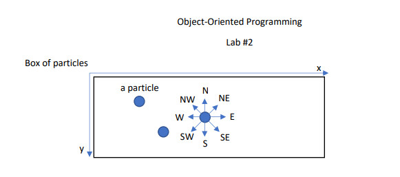
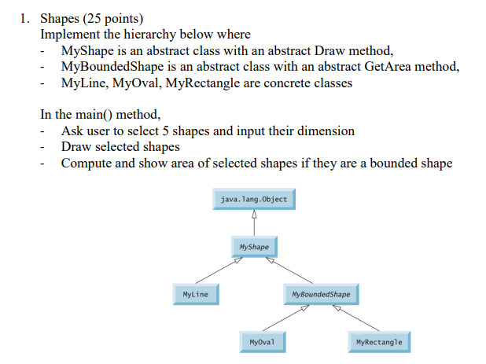
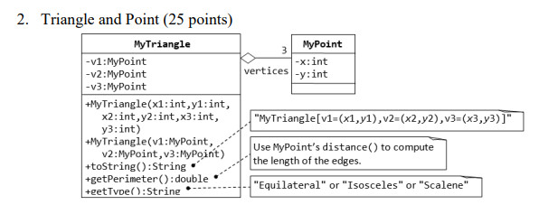
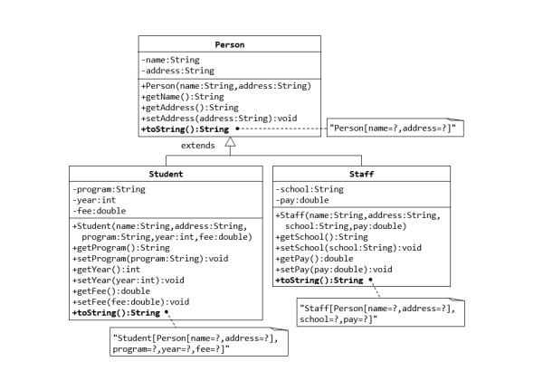
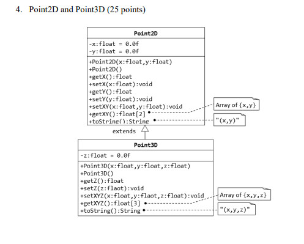
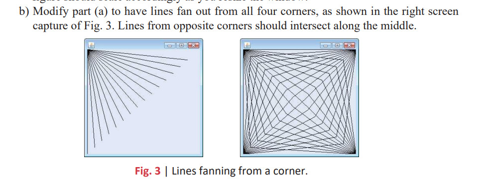
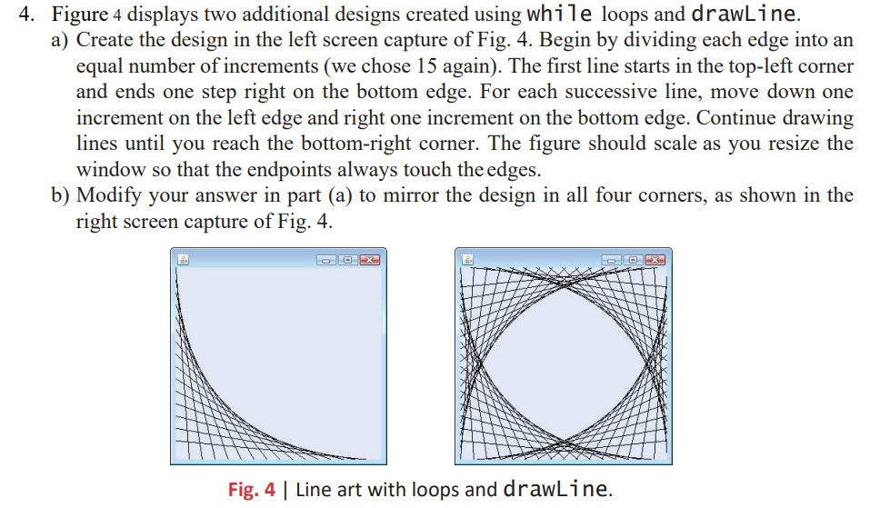

# Object-Oriented Programming_Laboratory

# Introduction
<p align="center">
  
</p>
Object-Oriented Programming Lab at an International University - VNUHCM - International University

## Index

- [About](#beginner-about)
- [Development](#wrench-development)
  - [Pre-Requisites](#notebook-pre-requisites)
  - [Developmen Environment](#nut_and_bolt-development-environment)
  - [File Structure](#file_folder-file-structure)
- [FAQ](#question-faq)
- [Resources](#page_facing_up-resources)
- [License](#lock-license)

## About
We will go through all 7 labs in this repository

### Lab 1 Rectangle Visualization, Triangle Verification, Distance, E-commerce Order
[PDF Folder](pdf/Lab1.pdf)

### Lab 2 Box of particles 
[PDF Folder](pdf/Lab2.pdf)
<p align="center">
  
</p>

### Lab 3 Inheritance
[PDF Folder](pdf/Lab3.pdf)
<p align="center">
  
</p>
<p align="center">
  
</p>
<p align="center">
  
</p>
<p align="center">
  
</p>

### Lab 4 
[PDF Folder](pdf/Lab4.pdf)
<p align="center">
  
</p>
<p align="center">
  
</p>

## Development

### Pre-Requisites
4 Basic Concepts of OOP and some Concepts of Interfaces, JFrame, JPanel, Graphics
- Abstraction
- Encapsulation
- Polymorphism
- Inheritance

### Development Environment
Setting up the working environment (Basic IDE can using Java)
- Visual Studio Code
- Eclipe
- Java Development Kit
- etc,..

### File Structure
```
.
├── .zip
│   ├── lab1.zip
│   ├── lab2.zip
│   ├── lab3.zip
│   ├── lab4.zip
|   ├── lab5.pdf
|   ├── lab6.pdf
|   ├── lab7.pdf
│── pdf
│   ├── lab1.pdf
│   ├── lab2.pdf
│   ├── lab3.pdf
│   ├── lab4.pdf
│   ├── lab5.pdf
│   ├── lab6.pdf   
│   ├── lab7.pdf    
├── src
│   ├── lab_1
|       ├── Item.java
│       ├── Order.java
│       ├── Point.java
│       ├── TestPoint.java
|       ├── TestE_commerceOrder
|       ├── Rectangle
|       ├── TestRectangle
│       ├── Triangle
│       ├── TestTriangle
│   ├── lab_2
|   ├── lab_3
|   ├── lab_4
|   ├── lab_5
|   ├── lab_6
|   ├── lab_7
├── LICENSE
└── README.md
```
## FAQ
[Ask a question](https://github.com/NgQsang/OOP_LAB/issues)

## Resources
### (+) Lab session 3
[Oracle Java Documentation](https://docs.oracle.com/javase/tutorial/java/IandI/index.html)
, [Inheritance in Java Tutorial](https://www.tutorialspoint.com/java/java_inheritance.htm)
### (+) Lab session 4
[Java How to program](https://github.com/nikhil-vytla/Java-How-to-Program-(Early-Objects)-10th-Edition.pdf)
, [Download Code Examples](https://github.com/pdeitel/JavaHowToProgram10eEarlyObjectsVersion)
, [Swing Tutorial](https://www.tutorialspoint.com/swing/index.htm)

## License
[](https://opensource.org/licenses/MIT)
